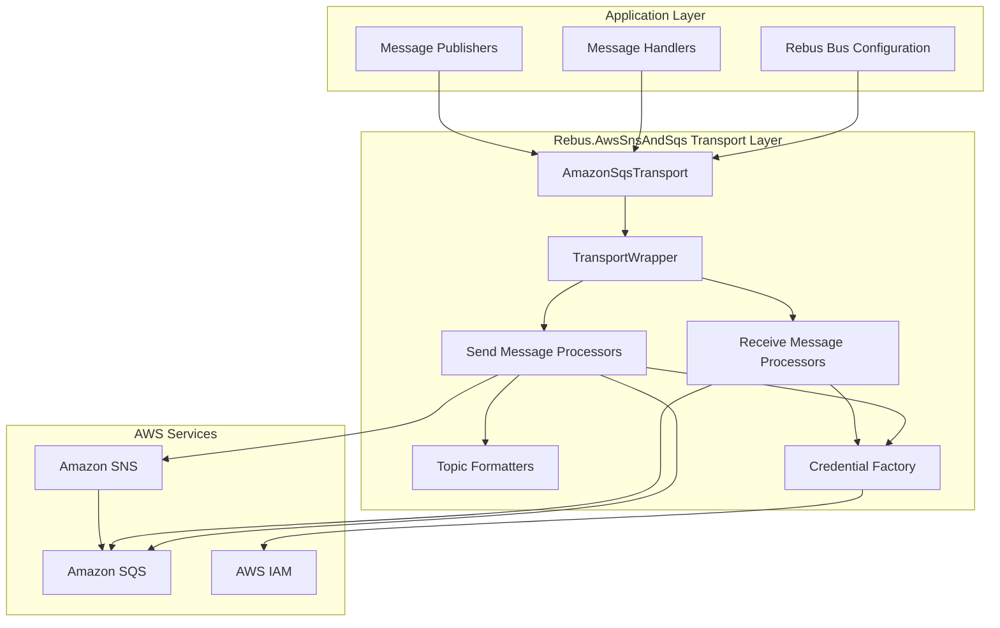
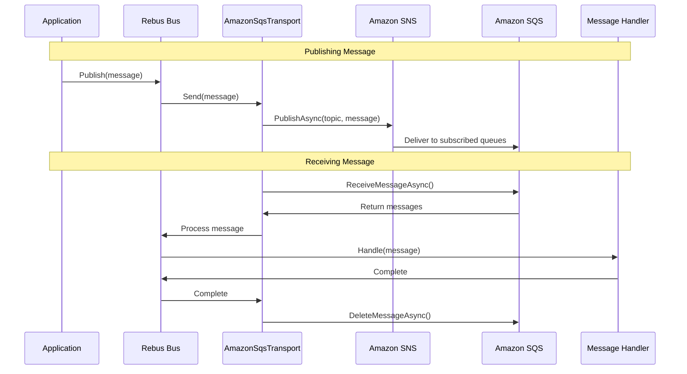
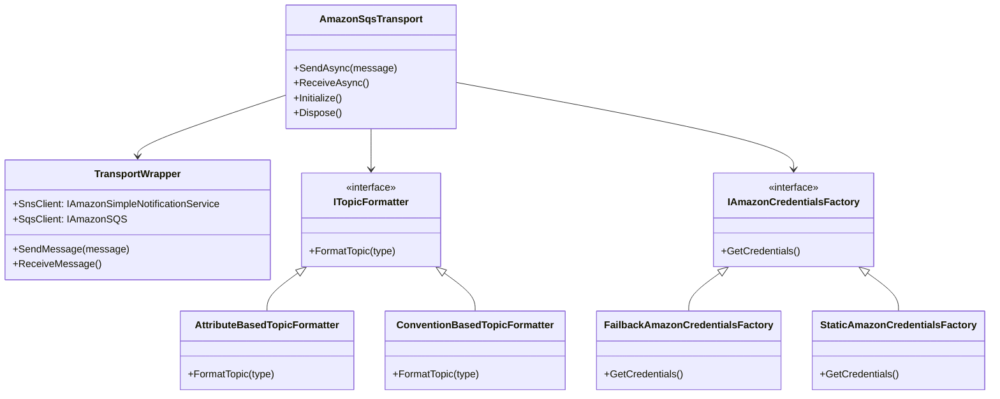
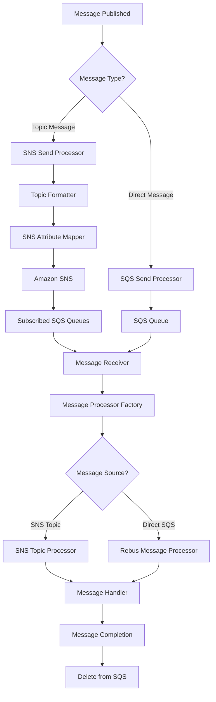
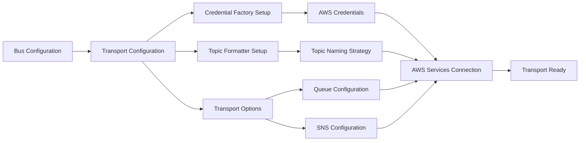

# Rebus.AwsSnsAndSqs Architecture Documentation

## Overview

Rebus.AwsSnsAndSqs is a .NET transport provider library that integrates AWS Simple Notification Service (SNS) and Simple Queue Service (SQS) with the Rebus messaging framework. This library enables distributed messaging patterns using AWS cloud infrastructure.

## Project Structure

```
Rebus.AwsSnsAndSqs/
├── Core Library (Rebus.AwsSnsAndSqs/)
│   ├── Core Components
│   │   ├── AttributeBasedTopicFormatter.cs
│   │   ├── ConventionBasedTopicFormatter.cs
│   │   ├── ITopicFormatter.cs
│   │   └── TopicNameAttribute.cs
│   ├── AWS Credentials
│   │   ├── FailbackAmazonCredentialsFactory.cs
│   │   ├── IAmazonCredentialsFactory.cs
│   │   └── StaticAmazonCredentialsFactory.cs
│   ├── Configuration (Config/)
│   │   ├── AmazonConfigurationExtensions.cs
│   │   ├── AmazonOneWayConfigExtension.cs
│   │   ├── AmazonSnsAndSqsTransportOptions.cs
│   │   └── OneWayClientErrorHandler.cs
│   ├── Transport Implementation (RebusAmazon/)
│   │   ├── Core Transport
│   │   │   ├── AmazonSqsTransport.cs
│   │   │   ├── AmazonSQSTransportFactory.cs
│   │   │   └── TransportWrapper.cs
│   │   ├── Send Operations (Send/)
│   │   │   ├── SnsAmazonSendMessageProcessor.cs
│   │   │   ├── SqsAmazonSendMessageProcessor.cs
│   │   │   └── SnsAttributeMapper.cs
│   │   └── Receive Operations (Receive/)
│   │       ├── RebusMessageAmazonMessageProcessor.cs
│   │       └── SnsTopicAmazonMessageProcessor.cs
│   └── Extensions/
│       └── StringExtension.cs
├── Performance Testing (Rebus.AwsSnsAndSqsPerformanceTest/)
├── Unit Tests (Rebus.AwsSnsAndSqsTests/)
└── Examples (RebusSnsSqsExample/)
```

## Key Features

### 1. Dual Transport Support
- **SNS (Simple Notification Service)**: Pub/Sub messaging pattern
- **SQS (Simple Queue Service)**: Point-to-point messaging pattern

### 2. Topic Formatting Strategies
- **Attribute-based**: Uses `TopicNameAttribute` for explicit topic naming
- **Convention-based**: Uses naming conventions for automatic topic resolution

### 3. Credential Management
- **Failback Strategy**: Automatic credential resolution with fallback options
- **Static Credentials**: Direct credential configuration
- **AWS Profile Support**: Integration with AWS credential profiles

### 4. Message Processing
- **Asynchronous Processing**: Non-blocking message handling
- **Attribute Mapping**: SNS message attribute handling
- **Serialization**: Built-in message serialization support

## Architecture Diagrams

### High-Level System Architecture



### Message Flow Sequence Diagram



### Class Diagram - Core Components



### Message Processing Flow



### Configuration Flow



## Branching Strategy

For detailed information about the project's branching strategy, version management, and contribution workflow, please refer to the dedicated [Branching Strategy Documentation](./BRANCHING-STRATEGY.md).

The project follows a Rebus major version alignment strategy where:
- **Master branch** contains the latest stable Rebus major version
- **Support branches** (`rebus-{major}-support`) are maintained for each Rebus major version
- **Feature/bugfix branches** follow standard GitFlow patterns

## Dependencies

### Core Dependencies
- **Rebus**: v7.0.0 (Messaging framework)
- **AWSSDK.Core**: v3.7.105.15
- **AWSSDK.SimpleNotificationService**: v3.7.101.22
- **AWSSDK.SQS**: v3.7.100.86

### Target Framework
- **.NET Standard 2.0**: Ensures compatibility with .NET Framework 4.6.1+ and .NET Core 2.0+

## Design Patterns

### 1. Factory Pattern
- `AmazonSQSTransportFactory`: Creates transport instances
- `AmazonMessageProcessorFactory`: Creates message processors
- `IAmazonCredentialsFactory`: Creates AWS credentials

### 2. Strategy Pattern
- `ITopicFormatter`: Different topic naming strategies
- Message processors for different message types

### 3. Wrapper Pattern
- `TransportWrapper`: Encapsulates AWS SDK clients
- `TransportWrapperSingleton`: Ensures single instance

### 4. Builder Pattern
- `SnsAttributeMapperBuilder`: Builds SNS attribute mappers

## Performance Considerations

### 1. Connection Management
- Singleton pattern for AWS client instances
- Connection pooling handled by AWS SDK

### 2. Message Batching
- SQS batch operations for improved throughput
- Configurable batch sizes

### 3. Async Processing
- Full async/await pattern implementation
- Non-blocking I/O operations

### 4. Error Handling
- Retry mechanisms with exponential backoff
- Dead letter queue support

## Security Features

### 1. Credential Management
- Support for AWS credential profiles
- IAM role-based authentication
- Failback credential resolution

### 2. Message Encryption
- SNS/SQS server-side encryption support
- Message attribute encryption

### 3. Access Control
- IAM policy-based access control
- Resource-based permissions

## Testing Strategy

### 1. Unit Tests (`Rebus.AwsSnsAndSqsTests/`)
- Transport functionality testing
- Message processing validation
- Configuration testing

### 2. Performance Tests (`Rebus.AwsSnsAndSqsPerformanceTest/`)
- Load testing capabilities
- Throughput measurement
- Latency analysis

### 3. Integration Tests
- AWS service integration
- End-to-end message flow testing

## Monitoring and Observability

### 1. Logging
- Structured logging support
- AWS CloudWatch integration ready

### 2. Metrics
- Message processing metrics
- Error rate tracking
- Performance counters

### 3. Health Checks
- AWS service connectivity checks
- Queue health monitoring

## Future Enhancements

### 1. Additional AWS Services
- Integration with AWS EventBridge
- Support for AWS Kinesis

### 2. Advanced Features
- Message deduplication
- FIFO queue support
- Cross-region replication

### 3. Tooling
- Configuration validation
- Deployment automation
- Monitoring dashboards

## Getting Started

### Basic Configuration

```csharp
var bus = Configure
    .With(activator)
    .Transport(t => t.UseAmazonSnsAndSqs(
        workerQueueAddress: "my-queue",
        amazonSqsConfig: new AmazonSQSConfig(),
        amazonSnsConfig: new AmazonSNSConfig()
    ))
    .Start();
```

### Advanced Configuration

```csharp
var bus = Configure
    .With(activator)
    .Transport(t => t.UseAmazonSnsAndSqs(
        workerQueueAddress: "my-queue",
        credentialsFactory: new FailbackAmazonCredentialsFactory(),
        topicFormatter: new AttributeBasedTopicFormatter()
    ))
    .Start();
```

---

*This architecture documentation provides a comprehensive overview of the Rebus.AwsSnsAndSqs library structure, design patterns, and implementation details. For specific implementation questions, refer to the source code and unit tests.*
